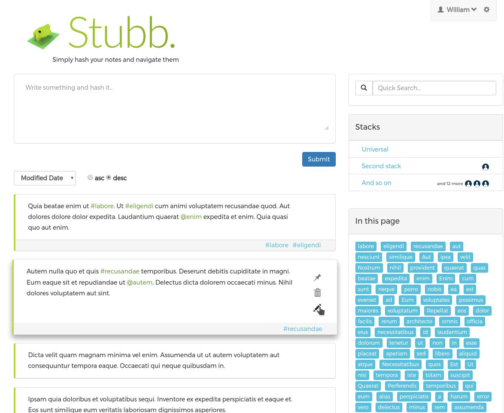

# Stubb

[WIP]

## What is it?
This is an example app that I'm uploading to show to recruiters. 
Basically, it allows you to create quick notes on any topic, and hashtag them. Then, you can easily search for notes by topic, keywords, date, etc. You also can group notes and share sets with othe users (useful for classrooms). 
Search is powered by Elasticsearch.

## Involved technologies
  - *Docker* for virtualization
  - *AngularJs* as frontend technology 
  - *Sass* as css precompiler  
  - *Nginx* as server
  - *PHP-fpm* as server process manager
  - *PHP 7* as language
  - *Robo* as tasks runner
  - *Laravel 5* as framework
  - *PHPUnit* for testing and TDD
  - *PostgreSQL* as database
  - *Elasticsearch* you know, for search

## Screenshot



## How to run
Init docker containers

`docker-compose up`

That may take long to download images.

### Config files
You should have two config files, one for frontend and the other for backend.

#### Front
Rename `src/public/src/app-config.example` to `app-config.js`

That file points to the API, and should work for you with this docker environment.

#### Back
Rename *.env.example* to *.env* and set the correct permissions. With exactly this:  
```
DB_CONNECTION=pgsql
DB_HOST=postgres-stubb
DB_PORT=5432
DB_DATABASE=postgres
DB_USERNAME=postgres
DB_PASSWORD=d4REn0LdCH4B
```

Hint: is important to replace DB_CONNECTION to *pgsql* instead of the default *mysql*

#### Create and seed DB
Now, in order to fill the database, run:

`docker exec -it php-stubb php /src/artisan migrate`

`docker exec -it php-stubb bash -c "php /src/artisan db:seed --class CardsSeeder"`

Or alternativelly just:
`cd app && vendor/bin/robo install`

#### Try it
Then, navigate to:
`http://localhost:8001/`

You should see the homepage.

Hint: configure a different port if neccesary and rerun docker.

#### Test user
If you want to skip the registering process, use these credentials:
`admin@stubb.net`
`sysadmin`
